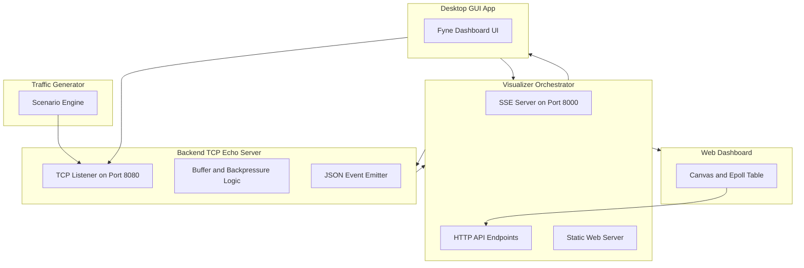

# Go Application Architecture & Code Overview

This project is a high-performance **TCP Epoll Server & Telemetry Visualization Suite** written in **Go**. It simulates an event-driven `epoll`-style networking architecture with real-time telemetry streaming, a web visualizer dashboard, a native desktop GUI, and a traffic generator.

---

## 1. Backend TCP Server (`server/main.go`)

- **File**: [server/main.go](file:///d:/Desktop/cool/sstapp/server/main.go)
- **Port**: `8080` (TCP)
- **Role**: Core TCP echo server simulating `epoll` socket event loop semantics in Go.

### Key Logic & Features:
1. **Telemetry Events (`TelemetryEvent`)**:
   - Emits structured JSON events to `os.Stdout` whenever network state changes:
     - `init`: Server started listening on port 8080 (`listen_fd=1`, `epoll_fd=1`).
     - `accept`: New client connection accepted (`fd=N`).
     - `read`: Received payload from client (`bytes_read=N`).
     - `write`: Flushed echo data to client socket (`bytes_written=N`).
     - `backpressure`: Triggered when client write buffer reaches $\ge 50\%$ capacity ($32\text{ KB}$).
     - `buffer_cleared`: Client buffer fully drained back to 0 bytes.
     - `close`: Client socket closed.
2. **Non-blocking Read Loop (`handleClient`)**:
   - Uses `bufio.Reader` and `conn.SetReadDeadline` to simulate non-blocking socket polling without burning CPU.
3. **Backpressure & Ring Buffer Management**:
   - Maintains per-client write buffers with a $64\text{ KB}$ threshold (`writeBufSize = 65536`).
   - When slow clients fail to consume echo data fast enough, buffer usage triggers `backpressure` events (equivalent to arming `EPOLLOUT`).

---

## 2. Visualizer Orchestrator (`visualizer/main.go`)

- **File**: [visualizer/main.go](file:///d:/Desktop/cool/sstapp/visualizer/main.go)
- **Port**: `8000` (HTTP)
- **Role**: HTTP Server, SSE Streamer, and Process Manager that bridges backend server telemetry to frontends.

### Key Logic & Features:
1. **Process Management**:
   - Spawns `server.exe` (or `go run server/main.go`) as a child process.
   - Pipes child `StdoutPipe()` into a line scanner to ingest real-time JSON telemetry events.
   - Monitors `os.Stdin` and OS shutdown signals (`SIGINT`, `SIGTERM`) to kill `server.exe` cleanly when the visualizer stops.
2. **Server-Sent Events (SSE) Engine (`/events`)**:
   - Streams live JSON events to all connected clients (`GUI` and web browser `index.html`).
   - Implements `lastInitEvent` caching so newly connected clients receive initial server state immediately.
   - Uses explicit `http.Flusher` flushing for sub-millisecond event delivery.
3. **HTTP Control API (`/api/*`)**:
   - `/api/status`: Returns current SSE subscriber counts and server health.
   - `/api/spawn_client`: Connects a new managed client to the TCP server.
   - `/api/send_data`: Sends test data payloads ($1\text{ KB}$ or $16\text{ KB}$) to trigger read/write telemetry.
   - `/api/choke_client`: Toggles socket read choking.
   - `/api/close_clients`: Closes all managed active TCP clients.
4. **Static Web Server (`/`)**:
   - Serves `index.html` (the HTML5 Canvas & Epoll topology web dashboard).

---

## 3. Native Desktop GUI (`gui/main.go`)

- **File**: [gui/main.go](file:///d:/Desktop/cool/sstapp/gui/main.go)
- **Framework**: Fyne (`fyne.io/fyne/v2`)
- **Role**: Desktop GUI dashboard providing visual inspection and interactive control of the epoll system.

### Key Logic & Features:
1. **Status Header & FDs**:
   - Live status indicator (`● Server Active | Port: 8080 | Clients: N`).
   - Displays listening file descriptor (`Listen FD`) and epoll file descriptor (`Epoll FD`).
2. **Interactive Control Panel**:
   - **➕ Spawn Client**: Opens a new TCP socket connection to `:8080`.
   - **💬 Send 1 KB**: Sends a $1\text{ KB}$ payload and reads the echo response.
   - **💥 Send 16 KB**: Sends a $16\text{ KB}$ burst payload to test write buffer fill rates.
   - **🛑 Toggle Choke**: Simulates socket read backpressure.
   - **🧹 Close All**: Drops all active client connections.
3. **Dual-Panel Telemetry View**:
   - **Epoll Architecture**: Real-time list of active client file descriptors (`fd=N`), backpressure flags (`BACKPRESSURE` / `Ready`), and buffer fill statistics (`X / 65536 bytes`).
   - **Event Telemetry**: Auto-scrolling, timestamped log of all server events (`[ACCEPT]`, `[READ]`, `[WRITE]`, `[BACKPRESSURE]`, `[CLOSE]`).
4. **Lifecycle & Clean Shutdown**:
   - Automatically launches `visualizer` (and by extension `server`) on startup.
   - Attaches an `io.Pipe` reader to stdin and registers window close listeners (`SetOnClosed`) to terminate the entire child process tree (`visualizer.exe` and `server.exe`) when the window is closed.

---

## 4. Traffic Generator (`traffic/main.go`)

- **File**: [traffic/main.go](file:///d:/Desktop/cool/sstapp/traffic/main.go)
- **Role**: Command-line load generator to stress test server concurrency and telemetry under load.

### Key Logic & Features:
1. **Normal Scenario (`go run . normal <num_clients> <duration_sec>`)**:
   - Opens $N$ persistent TCP client connections to `:8080`.
   - Sends payload bursts every $500\text{ ms}$ for the specified duration and verifies echo responses.
2. **Rapid Churn Scenario (`go run . churn <num_connections>`)**:
   - Rapidly dials `:8080`, sends a `PING`, and closes the socket immediately.
   - Tests server accept throughput, file descriptor recycling, and close telemetry events under rapid connection churn.

---

## Component Summary Table

| Component | Entry File | Port / Interface | Primary Responsibility |
| :--- | :--- | :--- | :--- |
| **Server** | [server/main.go](file:///d:/Desktop/cool/sstapp/server/main.go) | `TCP :8080` | High-performance TCP echo server with telemetry event emission |
| **Visualizer** | [visualizer/main.go](file:///d:/Desktop/cool/sstapp/visualizer/main.go) | `HTTP :8000` | Process orchestrator, SSE streamer, HTTP control API & web server |
| **Desktop GUI** | [gui/main.go](file:///d:/Desktop/cool/sstapp/gui/main.go) | Native Fyne Window | Cross-platform desktop control dashboard & event visualizer |
| **Traffic Gen** | [traffic/main.go](file:///d:/Desktop/cool/sstapp/traffic/main.go) | CLI Tool | Stress testing tool simulating steady traffic and rapid connection churn |
